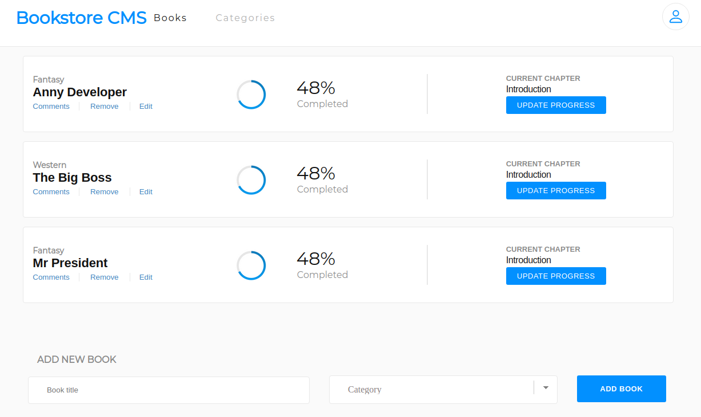

# Bookstore

## Live preview 
  ## Heroku [link](https://murmuring-hollows-84269.herokuapp.com/).
  ## Netlify [link](https://621a34b47f4ddae9c99da761--hopeful-euclid-a4fd8a.netlify.app/).

## Screenshots

## Contents
* [Bookstore(#bookstore)

## General info
This project is Single Page App with made with React-Redux.
You can add book and remove book. When you add book you create new book with author, tittle and category.

## Technologies
Project is created with:
* React 

* Redux
* JSX
* CSS
* API

## Setup
To run this project, install it locally using:
- cd Desktop
- git clone https://github.com/VuDej/Bookstore.git
- cd Bookstore
- npm install
- npm start 

## Author 1

👤 **Dejan Vujovic**

- Github : [@VuDej](https://github.com/VuDej)
- Twitter: [@DejanVuj](https://twitter.com/DejanVuj)
- LinkedIn : [@Dejan-Vujovic](https://www.linkedin.com/in/dejan-vujovic-5a0672225/)

## 🤝 Contributing

Contributions, issues, and feature requests are welcome!

Feel free to check the [issues page](https://github.com/VuDej/Bookstore/issues/3).

## Show your support

Give a ⭐️ if you like this project!

## Acknowledgments

- A special thanks to Microverse.

## 📝 License

This project is [MIT](LICENSE) licensed.

## Contact
Created by [@VuDej](https://github.com/VuDej)
